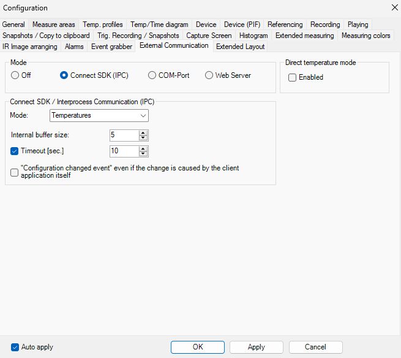

# About

A command line tool to trigger Xi410 camera shutter and save the image to folder provided.

# Prerequisites

 - VS 2022 Community with C++ components installed
 - PIX Connect SOftware Installed and running with a suitable camera connected

# Usage

```
Options:
  -e <path>      Specify the destination folder for the file copy.
  -t <milliseconds> Add a delay (in milliseconds) before copying the file.
  -n <file name> Set output file name
  --help         Display this help message.

Example:
  OptrisShutterTrigger.exe -e "C:\Path With Spaces\DestinationFolder" -t 5000
    Copies the latest modified file to the specified destination with a 5-second delay.
```

# Usefull links

 - [Optris Connect SDK](https://optris.com/software/apis-sdks/connect-sdk/)
 - [VS2022 Community](https://visualstudio.microsoft.com/vs/community/)

 # IMPORTANT

 Make sure that "Connect SDK (IPC)" is chosen under "External Communication" tab in PIX Connect Settings:

 

 # TODO

  * Implement Direct SDK